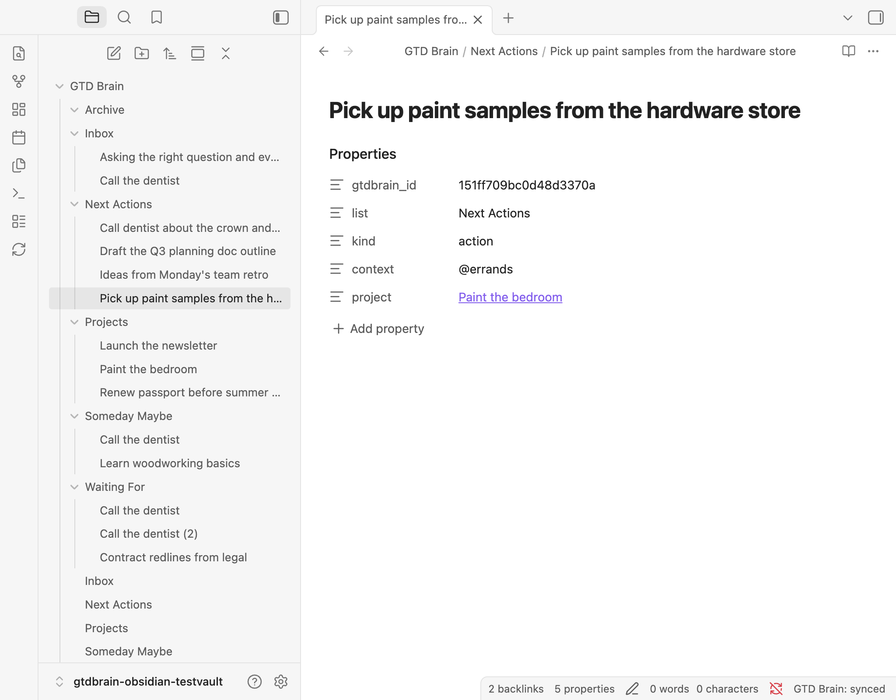

# GTD Brain


Run [Getting Things Done](https://gtdbrain.com) in your own vault and keep it in sync with your GTD Brain board.

The plugin lays out the classic GTD structure as plain Markdown — **Inbox**, **Next Actions** grouped by context, **Projects**, **Waiting For**, **Someday Maybe** — one note per card, plus a **Weekly Review** checklist. Edit a note, move it to another list folder, or create a new one, and the change lands on your GTD Brain board. Capture on your phone, from ChatGPT or Claude, and the note appears in your vault.

It is free and open source. Sign in with an email code — no password, no API key — and the vault becomes a GTD Brain account (or joins the one you already have).



## What you get

```
GTD Brain/
├── Inbox/                 one note per card — capture here
├── Next Actions/          actions; `context:` picks the @context
├── Projects/              outcomes; actions link to them with `project: "[[…]]"`
├── Waiting For/           delegated items; `who:` and `since:`
├── Someday Maybe/         incubating
├── Archive/               notes of archived cards
├── Inbox.md               generated list overviews (read-only)
├── Next Actions.md        …grouped by context
├── Projects.md            …with each project's next actions, flags projects without one
├── Waiting For.md         …as a table of item / who / since
├── Someday Maybe.md
└── Weekly Review.md       your checklist — created once, never overwritten
```

Every card note carries a small frontmatter block the sync reads and writes:

```yaml
---
gtdbrain_id: "1b2c…"        # the card on the board
list: "Next Actions"        # informational mirror of the folder
kind: "action"              # card | action | project
context: "@errands"         # Next Actions only — id or label, both work
project: "[[Paint the bedroom]]"
who: "Bob"                  # Waiting For
since: "2026-09-01"
---
The note body is the card's notes.
```

Any other property you add is yours and stays untouched. The vault is plain Markdown, so Dataview, Bases, backlinks and daily notes all work on it.

## Install

**From the community directory** (once listed): Settings → Community plugins → Browse → search "GTD Brain" → Install → Enable.

**From a release**, until then: download `main.js`, `manifest.json` and `styles.css` from the [latest release](https://github.com/minosin/gtdbrain-obsidian/releases/latest) into `<your vault>/.obsidian/plugins/gtd-brain/`, then reload Obsidian and enable the plugin. [BRAT](https://github.com/TfTHacker/obsidian42-brat) works too: add `minosin/gtdbrain-obsidian`.

## Use

1. **Sign in** — run the command *GTD Brain: Sign in* (or open the plugin settings). Enter your email, type the code we send you. A new email creates a free GTD Brain account and seeds a starter board.
2. **Set up GTD folders** — run *GTD Brain: Set up GTD folders*. The folders, the overview notes and the weekly review checklist are created, and every card you already have arrives as a note in the right folder.
3. **Work in Markdown** — a new note in `Inbox/` is a capture; move a note into `Next Actions/` to clarify it (set its `context:`), into `Waiting For/` with `who:`; rename a note to rename the card; the note body is the card's notes.
4. **Sync** happens on the interval you choose (default every 5 minutes), on startup, and on *GTD Brain: Sync now* (ribbon icon or command). The status bar shows the state.

### How the two-way sync decides

- The plugin remembers what each note looked like after the last sync. On the next sync it pushes **only the fields you changed** (title, body, context, project, who, since, folder) to the board, then pulls the board's state into the vault.
- If the same field changed in both places since the last sync, **your note wins** for that field and the board wins for everything else.
- **Deleting a note, or moving it out of the GTD folder, archives its card** on the next sync — nothing is ever deleted on the board. Cards archived on the board move to `Archive/` (or are trashed, if you turn off *Keep archived cards*). Unarchive on the web app and the note comes back.
- Only the notes inside the GTD folder's list folders are read or written. The rest of your vault is never touched.

## Network use, account and privacy — please read

- **An account is required.** The plugin is a client for [GTD Brain](https://gtdbrain.com); it does nothing until you sign in. Signing in with a new email creates a free account. The plugin and the sync are free; a GTD Brain subscription unlocks the AI features and the full mobile apps and is never required for this plugin.
- **Network requests** go to `https://api.minosin.com` (GTD Brain's backend, operated by Minosin AB) and nowhere else: to send you the sign-in code, to exchange it for a session token, and to read and write your board during a sync. Requests are made with Obsidian's `requestUrl` and only when you sign in, run a command, or on the sync interval you configure.
- **What is sent:** your email at sign-in; for each card note in the GTD folder, its title (file name), body, and the frontmatter fields listed above. Nothing outside the GTD folder, no other properties, no vault metadata.
- **Server-side logging:** like every GTD Brain client, requests are logged on the backend (endpoint, timestamp, a random per-install id the plugin generates, the plugin version, your account). There is no client-side telemetry or analytics in the plugin. How that data is handled: [gtdbrain.com/privacy](https://gtdbrain.com/privacy) · [terms](https://gtdbrain.com/terms).
- **Where the token lives:** the session token is stored in the plugin's `data.json` inside your vault's `.obsidian` folder, like any sync plugin. *Sign out* removes it. Do not share that file.

## Commands

| Command | What it does |
| --- | --- |
| Sync now | Push note changes to the board, pull the board into the vault |
| Set up GTD folders | Create the list folders, overview notes and the weekly review checklist |
| Sign in / Sign out | Email-code sign-in; sign-out keeps your notes |
| Open the web app | Opens dashboard.gtdbrain.com |

## Settings

GTD folder (default `GTD Brain`) · Sync every N minutes (0 = off) · Sync on startup · Keep archived cards · API address (advanced).

## Develop

```bash
npm install
npm run dev      # watch build → main.js
npm test         # vitest: sync engine against an in-memory vault + fake backend
npm run lint     # eslint with eslint-plugin-obsidianmd
npm run build    # type-check + production bundle
```

Copy `main.js`, `manifest.json`, `styles.css` into `<vault>/.obsidian/plugins/gtd-brain/` to test locally. The backend API this plugin uses is documented in the GTD Brain [connect guide for Obsidian](https://gtdbrain.com/connect/obsidian).

## Support

- Guide: https://gtdbrain.com/connect/obsidian
- Issues: https://github.com/minosin/gtdbrain-obsidian/issues
- Email: admin@minosin.com

## License

MIT © Minosin AB. Not affiliated with Obsidian.
